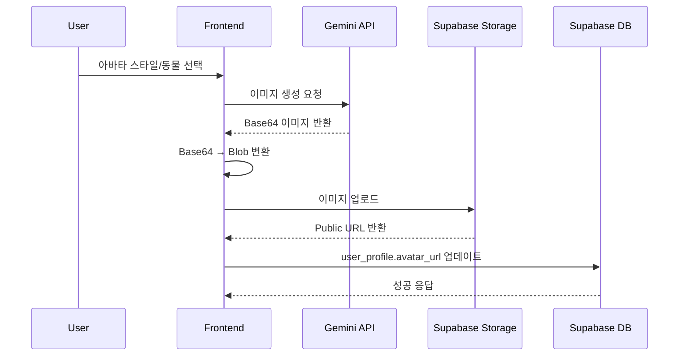

# 프로필 아바타 기능 사양서

## 개요

사용자 프로필에 AI 생성 아바타 기능을 추가했습니다. Google Gemini API를 사용하여 다양한 스타일의 동물 캐릭터 아바타를 생성하고, Supabase Storage에 저장합니다.

## 기술 스택

- **AI 이미지 생성**: Google Gemini API (Imagen 3.0)
- **Storage**: Supabase Storage
- **Database**: Supabase (PostgreSQL)

---

## 백엔드 요구사항

### 1. 데이터베이스 스키마

#### `user_profile` 테이블 (기존 테이블에 컬럼 추가)

```sql
ALTER TABLE user_profile
ADD COLUMN IF NOT EXISTS avatar_url TEXT;
```

| 컬럼명     | 타입 | 설명                              | 필수 |
| ---------- | ---- | --------------------------------- | ---- |
| avatar_url | TEXT | 생성된 아바타 이미지의 Public URL | NO   |

### 2. Supabase Storage 버킷

#### 버킷 설정

- **버킷명**: `avatar_img`
- **공개 설정**: Public (인증 없이 읽기 가능)
- **허용 MIME 타입**:
  - `image/png`
  - `image/jpeg`
  - `image/svg+xml`

#### Storage 정책 (RLS)

```sql
-- 인증된 사용자가 자신의 아바타 업로드 가능
CREATE POLICY "Users can upload own avatar" ON storage.objects
FOR INSERT TO authenticated
WITH CHECK (
  bucket_id = 'avatar_img' AND
  auth.uid()::text = (storage.foldername(name))[1]
);

-- 인증된 사용자가 자신의 아바타 삭제 가능
CREATE POLICY "Users can delete own avatar" ON storage.objects
FOR DELETE TO authenticated
USING (
  bucket_id = 'avatar_img' AND
  auth.uid()::text = (storage.foldername(name))[1]
);

-- 모든 사용자가 아바타 조회 가능
CREATE POLICY "Anyone can view avatars" ON storage.objects
FOR SELECT TO public
USING (bucket_id = 'avatar_img');
```

### 3. 환경 변수

프론트엔드에서 사용하는 환경 변수입니다. 백엔드에서 직접 사용하지 않지만, 참고용으로 기재합니다.

```env
# Google Gemini API Key
VITE_GOOGLE_API_KEY=your_google_api_key

# Supabase 설정 (기존)
VITE_SUPABASE_URL=your_supabase_url
VITE_SUPABASE_ANON_KEY=your_supabase_anon_key
```

---

## API 플로우

### 1. 아바타 생성 및 저장 플로우



### 2. 프론트엔드 요청 형식

#### Google Gemini API 요청

```javascript
POST https://generativelanguage.googleapis.com/v1beta/models/imagen-3.0-generate-002:predict

Headers:
{
  "Content-Type": "application/json",
  "x-goog-api-key": "GOOGLE_API_KEY"
}

Body:
{
  "instances": [
    {
      "prompt": "Cute cartoon avatar of a cute cat, Pixar animation style..."
    }
  ],
  "parameters": {
    "sampleCount": 1,
    "aspectRatio": "1:1"
  }
}
```

#### Supabase Storage 업로드

```javascript
// 파일명 형식: {user_uuid}_{timestamp}.png
// 예: 123e4567-e89b-12d3-a456-426614174000_1703123456789.png

const { error } = await supabase.storage
  .from("avatar_img")
  .upload(fileName, blob, {
    contentType: "image/png",
    cacheControl: "3600",
    upsert: true,
  });
```

#### Database 업데이트

```javascript
const { error } = await supabase
  .from("user_profile")
  .update({
    avatar_url: avatarUrl,
    display_name: displayName, // 선택사항
  })
  .eq("user_uuid", userId);
```

---

## 아바타 스타일 및 동물 옵션

### 아트 스타일 (10가지)

| ID           | 이름         | 설명                     |
| ------------ | ------------ | ------------------------ |
| realistic    | 사실적       | 사실적인 인물 초상화     |
| cartoon      | 카툰         | 귀여운 만화 스타일       |
| anime        | 애니메       | 일본 애니메이션 스타일   |
| 3d-render    | 3D 렌더      | 3D 렌더링 스타일         |
| watercolor   | 수채화       | 수채화 예술 스타일       |
| pixel-art    | 픽셀아트     | 8비트 픽셀 스타일        |
| minimalist   | 미니멀리스트 | 단순하고 깔끔한 스타일   |
| fantasy      | 판타지       | 판타지 캐릭터 스타일     |
| cyberpunk    | 사이버펑크   | 미래적 사이버펑크 스타일 |
| oil-painting | 유화         | 클래식 유화 스타일       |

### 동물 캐릭터 (15가지)

| ID      | 이름   | 프롬프트 값     |
| ------- | ------ | --------------- |
| cat     | 고양이 | cute cat        |
| dog     | 강아지 | friendly dog    |
| rabbit  | 토끼   | adorable rabbit |
| bear    | 곰     | cuddly bear     |
| panda   | 판다   | cute panda      |
| fox     | 여우   | clever fox      |
| wolf    | 늑대   | majestic wolf   |
| tiger   | 호랑이 | fierce tiger    |
| lion    | 사자   | brave lion      |
| owl     | 부엉이 | wise owl        |
| penguin | 펭귄   | cute penguin    |
| koala   | 코알라 | sleepy koala    |
| hamster | 햄스터 | tiny hamster    |
| unicorn | 유니콘 | magical unicorn |
| dragon  | 드래곤 | mythical dragon |

---

## 파일 구조

```
/src
├── utils/
│   └── avatarGenerator.ts       # 아바타 생성 및 업로드 로직
├── viewmodels/
│   └── ProfileViewModel.ts      # 프로필 관리 비즈니스 로직
├── views/
│   └── ProfileView.tsx          # 프로필 UI 컴포넌트
└── models/
    └── Profile.ts               # 프로필 타입 정의
```

---

## 주의사항

1. **Storage 버킷명**: 반드시 `avatar_img`를 사용해야 합니다.
2. **이전 아바타 삭제**: 새 아바타 업로드 시 사용자의 이전 아바타 파일은 자동 삭제됩니다.
3. **파일 형식**: PNG 형식으로만 저장됩니다.
4. **파일명 규칙**: `{user_uuid}_{timestamp}.png` 형식을 따릅니다.
5. **API 제한**: Google Gemini API는 요청당 제한이 있으므로 Rate Limiting 고려 필요

---

## 백엔드 작업 체크리스트

- [ ] `user_profile` 테이블에 `avatar_url` 컬럼 추가
- [ ] Supabase Storage에 `avatar_img` 버킷 생성
- [ ] Storage RLS 정책 설정
- [ ] 기존 사용자 데이터 마이그레이션 (필요시)
- [ ] 백엔드 API 엔드포인트 업데이트 (필요시)

---

## 테스트 시나리오

1. **아바타 최초 생성**

   - 신규 사용자가 아바타 생성
   - Storage에 파일 업로드 확인
   - DB avatar_url 업데이트 확인

2. **아바타 변경**

   - 기존 아바타가 있는 사용자가 새 아바타 생성
   - 이전 파일 삭제 확인
   - 새 파일 업로드 및 URL 업데이트 확인

3. **닉네임만 변경**

   - 아바타 생성 없이 닉네임만 변경
   - avatar_url이 변경되지 않음 확인

4. **동시 변경**
   - 닉네임과 아바타 동시 변경
   - 두 필드 모두 정상 업데이트 확인

---

## 연락처

프론트엔드 관련 문의사항이 있으시면 아래로 연락 주세요.

- 담당자: [담당자명]
- 이메일: [이메일]
- 슬랙: [슬랙 채널]

---

_작성일: 2024년 12월_
_버전: 1.0.0_
