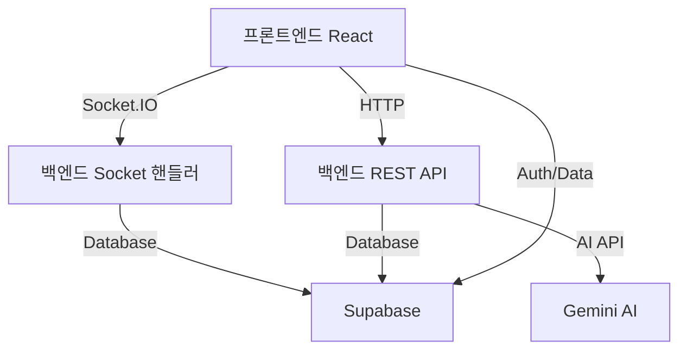

# AI 토론 시스템 프로젝트 설명서

## 📋 프로젝트 개요

AI 토론 시스템은 실시간 온라인 토론 플랫폼으로, 사용자들이 주어진 주제에 대해 찬성/반대 입장으로 나뉘어 토론하고 AI가 심판 역할을 하는 시스템입니다.

### 주요 기능

- 실시간 토론방 생성 및 참가
- 찬성/반대 입장 선택 및 토론 진행
- AI 심판 및 인간 심판 시스템
- 타이머 기반 턴제 토론
- ELO 레이팅 시스템
- 토론 자료 준비 및 AI 도움 기능

---

## 🖥️ 프론트엔드 구조 (React + TypeScript + Vite)

### 📁 디렉토리 구조

```
src/
├── components/        # React 컴포넌트
├── contexts/         # React Context API
├── lib/             # 라이브러리 및 유틸리티
├── models/          # 타입 정의
├── router/          # 라우터 설정
├── types/           # 추가 타입 정의
├── utils/           # 유틸리티 함수
├── viewmodels/      # 비즈니스 로직
└── views/           # 페이지 컴포넌트
```

### 📄 주요 프론트엔드 파일 설명

#### **핵심 파일**

**`src/App.tsx`**

- 애플리케이션의 루트 컴포넌트
- ThemeProvider와 UserProfileProvider로 전역 상태 관리
- AppRouter를 통해 라우팅 처리

**`src/main.tsx`**

- Vite 애플리케이션 진입점
- React DOM 렌더링 및 기본 설정

#### **ViewModel 계층 (MVVM 패턴)**

**`src/viewmodels/DiscussionViewModel.ts`**

- 토론 화면의 핵심 비즈니스 로직 관리
- Socket.IO를 통한 실시간 통신 처리
- 타이머, 메시지, 턴 관리
- AI 도움 요청 및 사용자 자료 관리
- 주요 기능:
  - `sendMessage()`: 메시지 전송
  - `requestAiHelp()`: AI 도움 요청
  - `preloadUserDocs()`: 사용자 자료 미리 로드
  - 실시간 상태 동기화

**`src/viewmodels/MainViewModel.ts`**

- 메인 화면 로직 (방 목록, 방 생성/참가)

**`src/viewmodels/RoomListViewModel.ts`**

- 대기실 화면 로직

#### **컴포넌트 계층**

**토론 관련 컴포넌트 (`src/components/discussion/`)**

- `DiscussionHeader.tsx`: 토론 헤더 (주제, 단계 정보)
- `MessageRenderer.tsx`: 메시지 렌더링 (AI 심판, 플레이어 발언)
- `PlayerList.tsx`: 플레이어 목록 표시
- `PlayerView.tsx`: 플레이어 인터페이스 (입력창, AI 도움)
- `RefereeView.tsx`: 심판 인터페이스 (채점, 시간 조정)
- `SpectatorView.tsx`: 관전자 인터페이스

**모달 컴포넌트 (`src/components/modals/`)**

- `BattleResultModal.tsx`: 토론 결과 모달
- `RefereeScoreModal.tsx`: 심판 채점 모달
- `CreateRoomModal.tsx`: 방 생성 모달

#### **상태 관리 (Context API)**

**`src/contexts/UserProfileProvider.tsx`**

- 사용자 프로필 전역 상태 관리
- Supabase 인증 상태 연동

**`src/contexts/ThemeProvider.tsx`**

- 다크/라이트 테마 상태 관리

#### **라이브러리 및 유틸리티**

**`src/lib/apiClient.ts`**

- Gemini AI API 통신 함수들
- `generateDiscussionHelp()`: 토론 도움 요청
- `generateArguments()`: 근거 생성
- `generateQuestions()`: 질문/답변 생성

**`src/lib/supabaseClient.ts`**

- Supabase 클라이언트 초기화
- 데이터베이스 및 인증 연결

#### **모델 및 타입**

**`src/models/Discussion.ts`**

```typescript
interface Message {
  text: string;
  sender: 'agree' | 'disagree' | 'system' | 'judge';
}

interface BattleResult {
  agree: { score: number; good: string; bad: string };
  disagree: { score: number; good: string; bad: string };
  winner: string;
}
```

**`src/models/Profile.ts`**

- 사용자 프로필 타입 정의

---

## 🖥️ 백엔드 구조 (Node.js + Express + Socket.IO)

### 📁 디렉토리 구조

```
src/
├── socket/          # Socket.IO 핸들러
├── routes/          # Express 라우터
├── utils/           # 유틸리티 함수
├── types/           # 타입 정의
├── models/          # 데이터 모델
└── index.ts         # 서버 진입점
```

### 📄 주요 백엔드 파일 설명

#### **서버 코어**

**`src/index.ts`**

- Express 서버 및 Socket.IO 서버 설정
- CORS 설정 및 보안 정책
- Supabase 연결 테스트
- 라우터 연결 (`/api/gemini`)
- Socket.IO 연결 핸들러 등록

#### **Socket.IO 핸들러**

**`src/socket/roomHandlers.ts`**

- 방 생성, 참가, 관리 로직
- 주요 이벤트 핸들러:
  - `get_subjects`: 토론 주제 목록 조회
  - `create_room`: 방 생성
  - `join_room`: 방 참가
  - `get_my_room`: 내 방 정보 조회
  - `player_ready`: 플레이어 준비 상태 변경
  - `select_role`: 역할 선택 (플레이어/관전자/심판)
  - `select_position`: 입장 선택 (찬성/반대)
  - `discussion_view_ready`: 토론 화면 준비 완료

**`src/socket/battleHandlers.ts`**

- 토론 진행 및 게임 로직 관리
- AI 심판 시스템
- 주요 이벤트 핸들러:
  - `start_battle_logic`: 토론 시작
  - `send_message`: 메시지 전송 및 단계 진행
  - `time_overflow`: 시간 초과 처리
  - `referee_*`: 심판 기능 (점수 조정, 시간 연장)
  - `get_room_state`: 방 상태 동기화

#### **REST API 라우터**

**`src/routes/gemini.ts`**

- Gemini AI API 연동 라우터
- 인증 미들웨어 포함
- 주요 엔드포인트:
  - `POST /generate-arguments`: 토론 근거 생성
  - `POST /generate-questions`: 예상 질문/답변 생성
  - `POST /generate-discussion-help`: 실시간 토론 도움

#### **유틸리티 함수**

**`src/utils/timeUtils.ts`**

- 타이머 관리 시스템
- 주요 함수:
  - `startTurnTimer()`: 턴 타이머 시작
  - `checkTimeLimit()`: 시간 제한 체크
  - `handleTimeOverflow()`: 시간 초과 처리
  - `handleAutomaticDefeat()`: 자동 패배 처리
  - `updatePlayerTime()`: 플레이어 시간 업데이트

**`src/utils/calculateEloRating.ts`**

- ELO 레이팅 계산

**`src/utils/saveBattleResult.ts`**

- 토론 결과 데이터베이스 저장

**`src/utils/updateUserStats.ts`**

- 사용자 통계 업데이트

---

## 🔄 프론트엔드-백엔드 데이터 통신 구조

### **통신 방식**

#### **1. Socket.IO (실시간 통신)**

- 방 관리, 토론 진행, 실시간 상태 동기화
- 양방향 통신으로 즉각적인 반응 처리

#### **2. REST API (HTTP)**

- AI 기능 (Gemini API 연동)
- 인증이 필요한 단발성 요청

#### **3. Supabase (데이터베이스 + 인증)**

- 사용자 인증 및 프로필 관리
- 토론 주제, 사용자 자료, 결과 저장

### **데이터 흐름**



---

## 🔌 Socket.IO 이벤트 상세 매핑

### **방 관리 이벤트 (roomHandlers.ts ↔ 프론트엔드)**

| 이벤트명          | 방향            | 설명                             | 프론트엔드 연동                       |
| ----------------- | --------------- | -------------------------------- | ------------------------------------- |
| `get_subjects`    | Client → Server | 토론 주제 목록 요청              | `WelcomeViewModel.ts`에서 호출        |
| `create_room`     | Client → Server | 방 생성 요청                     | `MainViewModel.ts`의 방 생성 로직     |
| `join_room`       | Client → Server | 방 참가 요청                     | `RoomListViewModel.ts`의 방 참가 로직 |
| `get_my_room`     | Client → Server | 내 방 정보 요청                  | 페이지 진입 시 자동 호출              |
| `rooms_update`    | Server → Client | 방 목록 업데이트                 | `RoomListView.tsx`에서 실시간 반영    |
| `room_update`     | Server → Client | 특정 방 정보 업데이트            | 방 내부 상태 실시간 동기화            |
| `player_ready`    | Client → Server | 플레이어 준비 상태 변경          | `PlayerList.tsx`의 준비 버튼          |
| `select_role`     | Client → Server | 역할 선택 (플레이어/심판/관전자) | 방 내부 역할 변경 UI                  |
| `select_position` | Client → Server | 입장 선택 (찬성/반대)            | 토론 시작 전 입장 선택                |

### **토론 진행 이벤트 (battleHandlers.ts ↔ DiscussionViewModel.ts)**

| 이벤트명                | 방향            | 설명                      | 프론트엔드 처리               |
| ----------------------- | --------------- | ------------------------- | ----------------------------- |
| `join_discussion_room`  | Client → Server | 토론방 입장               | `useEffect`에서 자동 호출     |
| `discussion_view_ready` | Client → Server | 토론 화면 준비 완료       | 컴포넌트 마운트 시 자동 전송  |
| `send_message`          | Client → Server | 메시지 전송               | `sendMessage()` 함수에서 호출 |
| `ai_judge_message`      | Server → Client | AI 심판 메시지            | `MessageRenderer.tsx`에 표시  |
| `turn_info`             | Server → Client | 턴 정보 업데이트          | 현재 턴 플레이어 UI 업데이트  |
| `messages_updated`      | Server → Client | 전체 메시지 목록 업데이트 | 메시지 목록 실시간 동기화     |
| `player_list_updated`   | Server → Client | 플레이어 목록 업데이트    | 역할/입장 정보 동기화         |
| `timer_update`          | Server → Client | 타이머 정보 업데이트      | 타이머 UI 실시간 업데이트     |
| `room_state_updated`    | Server → Client | 전체 방 상태 동기화       | 새로고침 시 상태 복원         |

### **심판 기능 이벤트**

| 이벤트명                   | 방향            | 설명                     | 프론트엔드 연동                  |
| -------------------------- | --------------- | ------------------------ | -------------------------------- |
| `referee_add_points`       | Client → Server | 가산점 부여              | `RefereeView.tsx`의 점수 조정    |
| `referee_deduct_points`    | Client → Server | 감점 부여                | `RefereeView.tsx`의 점수 조정    |
| `referee_extend_time`      | Client → Server | 시간 연장                | `RefereeView.tsx`의 시간 조정    |
| `referee_submit_scores`    | Client → Server | 최종 점수 제출           | `RefereeScoreModal.tsx`에서 호출 |
| `show_referee_score_modal` | Server → Client | 심판 채점 모달 표시 요청 | 모달 자동 팝업                   |
| `penalty_applied`          | Server → Client | 감점 적용 알림           | UI에 감점 정보 표시              |
| `overtime_granted`         | Server → Client | 연장시간 부여 알림       | 연장시간 타이머 시작             |

### **결과 처리 이벤트**

| 이벤트명        | 방향            | 설명           | 프론트엔드 처리              |
| --------------- | --------------- | -------------- | ---------------------------- |
| `battle_result` | Server → Client | 토론 결과 전송 | `BattleResultModal.tsx` 표시 |
| `battle_error`  | Server → Client | 토론 오류 알림 | 에러 메시지 표시             |

---

## 🧠 핵심 비즈니스 로직

### **토론 진행 단계**

1. **대표발언 단계** (1-2단계)

   - 찬성측, 반대측 순서로 주장 발표
   - 각각 2분 시간 제한

2. **질문/답변 단계** (3-7단계)

   - 교대로 질문하고 답변
   - 상대방 주장에 대한 반박 기회

3. **최종발언 단계** (8-9단계)

   - 최종 정리 및 마무리 발언

4. **AI 심판 평가** (10단계)
   - Gemini AI가 토론 내용 분석
   - 논리성, 근거 타당성, 설득력 기준 채점

### **타이머 시스템**

- **라운드 타이머**: 각 턴당 2분 제한
- **전체 타이머**: 플레이어당 총 5분 제한
- **연장시간**: 시간 초과 시 30초 연장 (3점 감점)
- **자동 패배**: 18점 누적 시 자동 패배

### **채점 시스템**

- **AI 채점**: Gemini AI의 자동 채점
- **인간 심판**: 관리자가 수동 채점 (AI 점수와 평균)
- **ELO 레이팅**: 결과에 따른 레이팅 변동

---

## 🔧 개발 환경 설정

### **프론트엔드**

```bash
# 의존성 설치
npm install

# 개발 서버 실행
npm run dev

# 빌드
npm run build
```

### **백엔드**

```bash
# discussion-server 디렉토리에서
npm install

# 개발 서버 실행
npm run dev

# 프로덕션 빌드
npm run build
```

### **환경 변수**

**프론트엔드 (.env)**

```
VITE_SERVER_URL=http://localhost:3050
VITE_SUPABASE_URL=your_supabase_url
VITE_SUPABASE_ANON_KEY=your_supabase_key
```

**백엔드 (.env)**

```
GEMINI_API_KEY=your_gemini_api_key
SUPABASE_URL=your_supabase_url
SUPABASE_SERVICE_ROLE_KEY=your_service_role_key
PORT=3050
```

---

## 📊 데이터베이스 스키마 (Supabase)

### 주요 테이블

- `user_profile`: 사용자 프로필 및 레이팅
- `subjects`: 토론 주제
- `docs`: 사용자 준비 자료
- `battles`: 토론 결과 기록
- `rooms`: 방 정보 (필요시)

---

## 🚀 추가 기능 및 확장 가능성

1. **모바일 앱 지원**: React Native 포팅
2. **음성 토론**: WebRTC 음성 채팅 추가
3. **토너먼트 시스템**: 대회 형태 토론
4. **AI 코치**: 개인별 토론 실력 향상 도움
5. **다국어 지원**: i18n 국제화

---

## 📞 문제 해결 및 디버깅

### 일반적인 문제

1. **Socket 연결 실패**: 서버 URL 및 CORS 설정 확인
2. **AI 응답 오류**: Gemini API 키 및 할당량 확인
3. **데이터베이스 오류**: Supabase 연결 상태 확인
4. **타이머 동기화 문제**: 서버 시간 기준으로 처리됨

### 로그 확인

- 프론트엔드: 브라우저 개발자 도구 콘솔
- 백엔드: 서버 콘솔 로그
- 데이터베이스: Supabase 대시보드

---

이 문서는 새로운 개발자가 프로젝트를 이해하고 개발에 참여할 수 있도록 작성되었습니다. 추가 질문이나 상세한 설명이 필요한 부분이 있다면 언제든 문의하세요.
